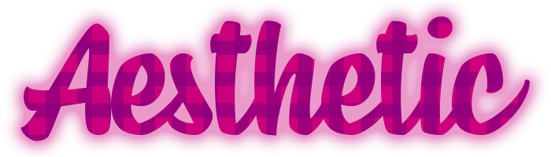

# Aesthetic Site Stock Gallery

Este foi meu primeiro site desenvolvido completamente por mim, é claro que eu tive ajuda, mas toda a idealização, planejamento e execução foram feitos por mim.

Os principais objetivos da criação deste site foram:
<ul>
  <li>Treinar e aprimorar minhas habilidades com HTML, CSS e JavaScript;</li>
  <li>Aprender como fazer um site com layout responsivo;</li>
  <li>Desenvolver minhas habilidades de pesquisa e resolução de desafios.</li>
</ul>

O site teve como principal inspiração o layout do Pinterest.

Para a resolução de alguns obstáculos eu tive como ajuda um amigo <a href="https://github.com/georgebias">@georgebias</a> e alguns artigos que deixarei os links abaixo:

Criação da filtragem de imagens: https://www.geeksforgeeks.org/how-to-clear-the-content-of-a-div-using-javascript/ 
Tutorial para criar a grid de imagens: https://www.youtube.com/watch?v=jqx_gANtNhg

Para a organização e execução do projeto eu utilizei alguns softwares:
<ul>
  <li>Visual Studio Code;</li>
  <li>Photoshop;</li>
  <li>Trello;</li>
  <li>Firefox e Chrome;</li>
  <li>Hyper Terminal;</li>
  <li>DevDocs;</li>
  <li><a href="https://coolors.co/">Coolors</a>.</li>
</ul>

